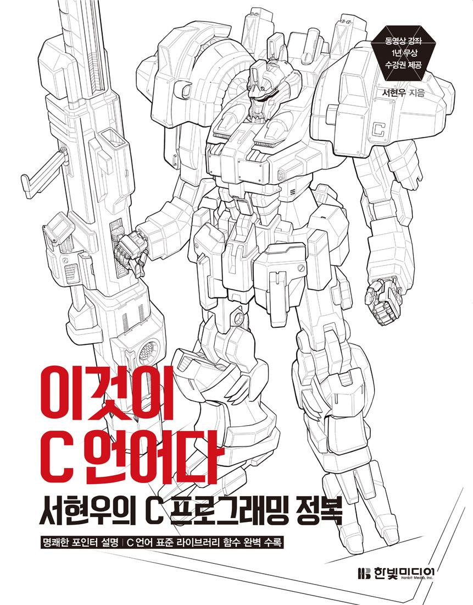

<h1>이것이 C언어다</h1>

  <kbd></kbd>

  Chap 01 프로그램 만들기 <a href="./md/chap-01/chap-01.md">노트</a> <a href="./src/chap-01">소스</a> 
  Chap 02 상수와 데이터 출력 <a href="./md/chap-02/chap-02.md">노트</a> <a href="./src/chap-02">소스</a> 
  Chap 03 변수와 데이터 입력 <a href="./md/chap-03/chap-03.md">노트</a> <a href="./src/chap-03">소스</a> 
  Chap 04 연산자 <a href="./src/chap-04">소스</a> 
  Chap 05 선택문 (if, switch~case) <a href="./src/chap-05">소스</a> 
  Chap 06 반복문 <a href="./src/chap-06">소스</a> 

