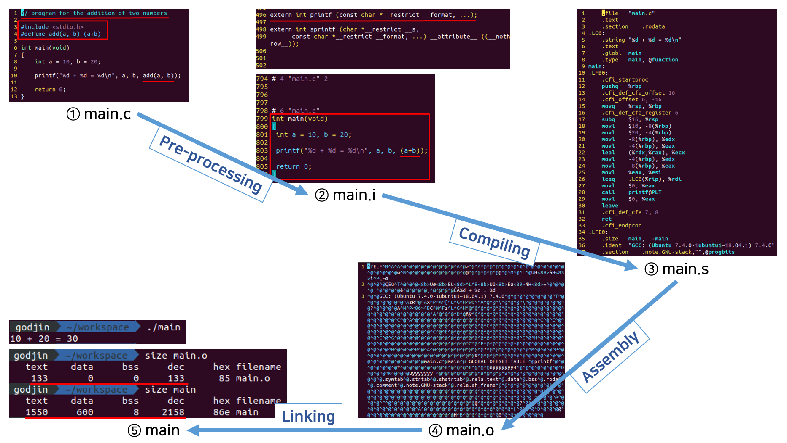
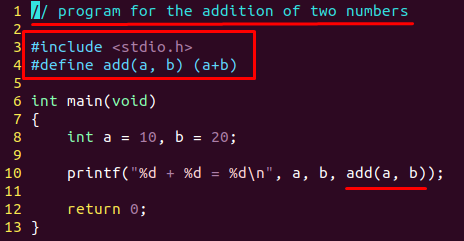
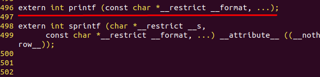
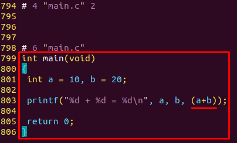
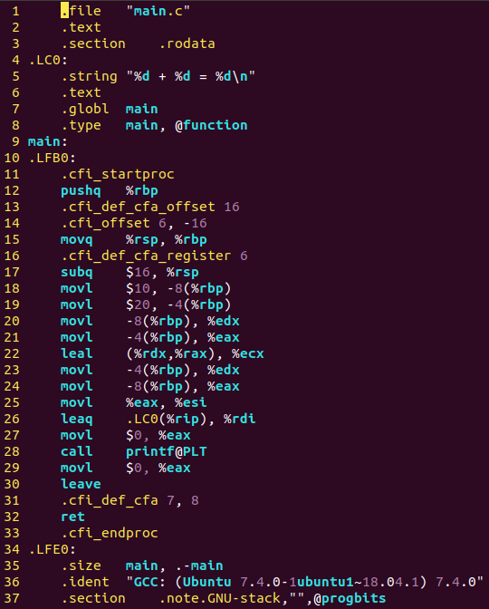
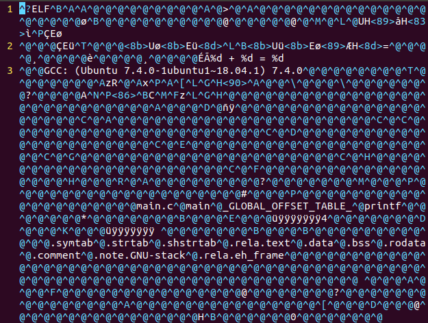
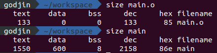

<h1>Chap 01 프로그램 만들기</h1>

<h3>1.1 프로그램과 C언어</h3>

```
C언어: 1972년 데니스 리치(Dennis Ritchie)가 유닉스 시스템에 사용하기 위해 켄 톰슨이 만든 B언어를 발전시킨 언어

- 기종이 다른 컴퓨터에서 사용할 수 있는 이식성(portability) 높은 프로그램을 만들 수 있다.
- 하드웨어를 제어하는 시스템 프로그래밍이 가능하다.
- 함수를 사용하여 기능별로 프로그래밍이 가능하므로 개발 과정에서 에러를 수정하기 쉽고, 유지보수에 도움이 된다.
```

<h3>1.2 컴파일 과정</h3>

<p>
  <kbd></kbd>
</p>

<table>
  <tbody>
    <tr>
      <td width="18%"><b>Source File</b></td>
      <td width="55%">
        <br>
        <em>main.c</em>
      </td>
      <td>C언어로 작성된 문서</td>
    </tr>
    <tr>
      <td><b>Pre-processing</b></td>
      <td>
        <br>
        <br>
        <em>main.i</em>
      </td>
      <td>
        main.c &#10140; 전처리기 &#10140; main.i<br>
        전처리기는 다음을 수행한다.<br><br>
        <ul>
          <li>주석 제거</li>
          <li>매크로 확장</li>
          <li>include 된 파일 확장</li>
          <li>조건부 컴파일</li>
        </ul>
      </td>
    </tr>
    <tr>
      <td><b>Compiling</b></td>
      <td>
        <br>
        <em>main.s</em>
      </td>
      <td>
        main.i &#10140; 컴파일러 &#10140; main.s<br>
        어셈블리 코드로 변환된다.
      </td>
    </tr>
    <tr>
      <td><b>Assembly</b></td>
      <td>
        <br>
        <em>main.o</em>
      </td>
      <td>
        main.s &#10140; 어셈블러 &#10140; main.o<br>
        기계어로 변환된다.<br>
        (단 함수 호출문의 경우 본 단계에서 처리되지 않고, 링킹 과정에서 함수가 정의된 위치(포인터) 정보로 치환된 후 기계어로 변환된다.)
      </td>
    </tr>
    <tr>
      <td><b>Linking</b></td>
      <td>
        
      </td>
      <td>
        함수 호출문을 함수가 정의된 위치(포인터) 정보로 치환 후 기계어로 변환한다.<br>
        운영체제가 프로그램을 시작하고 끝내는데 필요한 코드들을 추가한다.
      </td>
    </tr>
  </tbody>
</table>
