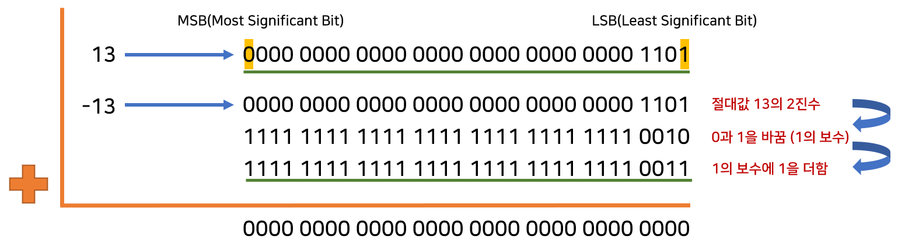
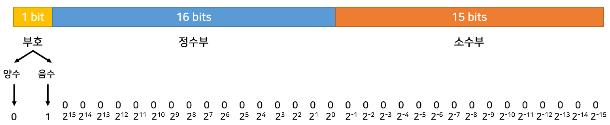

<h1>Chap 02 상수와 데이터 출력</h1>

<h3>2.1 C 프로그램의 기본 형태와 데이터 출력 방법</h3>

<b><em>2.1.1 main 함수 구조</em></b>
<p>
  C 프로그램은 main 함수로 시작된다.<br>
  함수란 일정 기능을 수행하는 코드 단위를 의미하며, Head와 Body로 구성된다.<br>
  <kbd></kbd>
</p>

<b><em>2.1.2 출력 함수(printf)의 사용법</em></b>
<p>
  printf 함수는 화면에 문자열을 출력한다.<br>
  원형은 다음과 같다.<br>
  <code>int printf(const char* format, ...)</code><br>
</p>

<b><em>2.1.3 printf 함수로 제어 문자 출력</em></b>
<p>
  제어 문자(Control Character)는 일반 문자와 구분하기 위하여 백슬래시(\, 키보드에서 &#8361;)와 함께 사용한다.<br>
  문자열 안에 포함시키면 그 기능에 따라 출력 형태가 바뀐다.<br>
  <table>
    <thead>
      <tr>
        <th>제어 문자</th>
        <th>의미</th>
        <th>기능</th>
      </tr>
    </thead>
    <tbody>
      <tr>
        <td>\n</td>
        <td>개행(new line)</td>
        <td>줄을 바꾼다.</td>
      </tr>
      <tr>
        <td>\t</td>
        <td>탭(tab)</td>
        <td>출력 위치를 다음 탭 위치로 옮긴다.</td>
      </tr>
      <tr>
        <td>\r</td>
        <td>캐리지 리턴(carriage return)</td>
        <td>출력 위치를 줄의 맨 앞으로 옮긴다.</td>
      </tr>
      <tr>
        <td>\b</td>
        <td>백스페이스(back space)</td>
        <td>출력 위치를 한 칸 왼쪽으로 옮긴다.</td>
      </tr>
      <tr>
        <td>\r</td>
        <td>알림(alert)</td>
        <td>경보 벨 소리를 낸다.</td>
      </tr>
    </tbody>
  </table>
</p>

<b><em>2.1.4 printf 함수로 정수와 실수 출력</em></b>
<p>
  printf 함수로 숫자 출력 시 문자열로 변환하는 과정이 필요하다.<br>
  변환 방법은 데이터의 형태에 따라 다르다.<br>
  <br>
  
</p>

<h3>2.2 상수와 데이터 표현 방법</h3>

```
상수(Constant)란 값이 바뀌지 않는 데이터를 의미한다.
C언어에서 다루는 데이터는 정수, 실수, 문자, 문자열이 있다.
```

<b><em>2.2.1 정수 상수 표현법</em></b>
<p>
  정수는 아라비아 숫자 0 ~ 9, '+', '-' 기호를 사용하며 세 가지 진법으로 표현한다.
  <ul>
    <li>
      10진법: 0 ~ 9까지 10가지 숫자를 사용한다.
    </li>
    <li>
      8진법: 0 ~ 7까지 8가지 숫자를 사용하며, 10진수와 구분하기 위하여 숫자 앞에 0을 붙인다.
    </li>
    <li>
      16진법: 아라비아 숫자 0 ~ 9, 영문자 a ~ f를 합쳐 총 16개의 단위 숫자를 사용하며, 숫자 앞에 0x를 붙인다.
    </li>
  </ul>
</p>

<b><em>2.2.2 실수 상수 표현법</em></b>
<p>
  실수는 소수점 형태와 지수 형태로 표현한다.<br>
  소수점 형태는 값이 아주 크거나 작은 경우 사용하기 불편하다.<br>
  소수점 형태를 지수 형태로 바꾸는 방법은 다음과 같다.<br>
  <kbd></kbd>
</p>

<b><em>2.2.3 문자와 문자열 상수 표현법</em></b>
<p>
  문자는 작은 따옴표('')로 묶고, 문자열은 큰 따옴표("")로 묶는다.
</p>

<b><em>2.2.4 상수가 컴파일 된 후의 비트 형태</em></b>
<p>
  편집기로 소스코드를 작성 시 개발자가 입력한 문자들은 모두 아스키 코드 값으로 저장된다.<br>
  때문에 컴파일러는 컴파일을 할 때 연산자는 명령어로, 상수들은 연산이 가능한 형태로 바꾼다.<br>
  이때 상수의 종류에 따라 번역 형태가 달라진다.
  <table>
    <thead>
      <tr>
        <th>상수 종류</th>
        <th>크기(byte)</th>
        <th>바뀌는 형태</th>
      </tr>
    </thead>
    <tbody>
      <tr>
        <td>정수</td>
        <td>4</td>
        <td>2진수</td>
      </tr>
      <tr>
        <td>실수</td>
        <td>8</td>
        <td>IEEE 754 표준 double 형</td>
      </tr>
      <tr>
        <td>문자</td>
        <td>4</td>
        <td>아스키 코드 값과 같은 2진수</td>
      </tr>
    </tbody>
  </table> 
</p>

<b><em>2.2.5 정수형 상수가 컴파일된 후의 비트 형태</em></b>
<p>
  0을 포함한 양의 정수는 컴파일 후 4바이트 크기의 2진수로 변환된다.<br>
  음의 정수는 덧셈 연산의 편의를 위하여 2의 보수로 처리된다.<br>
  <kbd><kbd>
</p>
    
<b><em>2.2.6 실수형 상수가 컴파일된 후의 비트 형태</em></b>
<p>
  실수 또한 정수와 마찬가지로 2진수로 표현되어야 한다.<br>
  2진수로는 10진수를 항상 정확하게 표현할 수 없기 때문에, 오차가 발생하고 근사값이 저장된다.<br>
  근사값을 저장하는 방식은 크게 두가지가 있다.
  <table>
    <tbody>
      <tr>
        <td width="260px">고정 소수점(Fixed Point) 방식</td>
        <td>
          실수 = 정수부 + 소수부<br>
          정수부 비트 수와 소수부 비트 수를 미리 정해놓고, 해당 비트 만큼만 사용하여 숫자를 표현하는 방식<br>
          비트 수가 제한되어 있기 때문에, 표현할 수 있는 값의 범위가 작다.<br><br>
          <br>
          위의 그림은 32비트 실수를 고정 소수점 방식으로 표현한 예시이다.<br><br>
          실수 263.3의 경우 263 + 0.3으로 나눌 수 있다.<br>
          따라서 부호: 0, 정수부: 0000000100000111, 소수부: 010011001100110인<br>
          0 / 0000000100000111 / 010011001100110로 저장된다.
        </td>
      </tr>
      <tr>
        <td>부동 소수점(Floating Point) 방식</td>
        <td>
          실수 = ±(1.가수부) × 2<sup>지수부 + 127</sup> (IEEE 754 표준)<br>
          표현할 수 있는 값의 범위가 크다.<br><br>
          float(32비트), double(64비트)형 실수를 부동 소수점 방식으로 표현하면 다음과 같다.<br>
          <br>
          <br>
          <br><br>
          실수 263.3은 고정 소수점 방식에서 100000111.010011001100110로 표현되었다.<br>
          부동 소수점 방식으로 변환하기 위해서 소수점의 위치를 맨 앞 1 바로 뒤로 이동한다.<br>
          100000111.010011001100110 = 1.00000111010011001100110 × 2<sup>8</sup>이 성립하므로<br>
          부호: 0, 지수부: 10000111(8 + 127), 가수부: 00000111010011001100110인<br>
          0 / 10000111 / 00000111010011001100110로 저장된다.
        </td>
      </tr>
    </tbody>
  </table>
</p>
